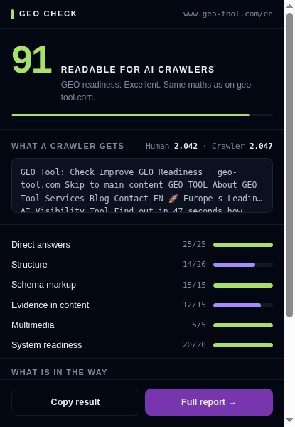

# GEO Check — browser extension

**Can ChatGPT read the page you are looking at?** One click on the toolbar
icon scores the open tab for AI readability: crawler access, schema markup,
answer structure, and what the content looks like without JavaScript —
scored 0–100 by the same engine as [geo-tool.com](https://www.geo-tool.com).

**Everything runs in your browser.** The extension never calls geo-tool.com
or any other backend — the build fails if a network path slips into the
bundle. That is why it can check what no server-side tool can:

|                                        | Website audit                | Extension                   |
| -------------------------------------- | ---------------------------- | --------------------------- |
| Pages behind login, staging, localhost | not reachable                | checkable                   |
| Response time                          | synthetic, from one region   | your real connection        |
| JavaScript visibility gap              | needs a paid render proxy    | the rendered DOM is present |

- **Chrome / Edge:** MV3, `activeTab` + `scripting` only, no host permissions
- **Firefox:** Gecko ID `geo-check@geo-tool.com`, min version 121
- **Languages:** German + English (follows the browser UI language)
- **Siblings:** [geo-tool-check](https://github.com/geo-tool-com/geo-tool-check)
  (CLI + MCP server, same engine) · [hosted audit](https://www.geo-tool.com)

## When to use it

- _"Can ChatGPT read this page?"_ — one click on any open tab
- _Staging, intranet, localhost_ — pages no server-side checker can reach
- _Before publishing_ — check a CMS preview while it is still behind login
- _The JavaScript gap_ — the popup compares what a human sees against the
  words a no-JavaScript crawler gets from the raw HTML
- _Share the verdict_ — the result link encodes the check client-side and
  opens a report page; nothing is uploaded

## How it works

1. You click the icon — that click **is** the permission (`activeTab`).
2. `src/collect.ts` runs inside the tab and gathers evidence: rendered DOM,
   raw HTML re-fetch, `robots.txt`, `llms.txt` — all addressed to the tab's
   own origin.
3. The vendored engine (`src/core/`) computes the same 0–100 score as the
   website audit and the CLI, and the popup renders verdict, category bars,
   and findings. Nothing leaves the browser.

## Install

- Chrome Web Store / Firefox Add-ons: listing in progress — see
  [docs/store-listing.md](docs/store-listing.md)
- **From the release:** download `geo-check-extension.zip` from the
  [latest release](https://github.com/geo-tool-com/geo-tool-extension/releases/latest),
  unzip, then `chrome://extensions` → Developer mode → Load unpacked.
- **From source:** `npm ci && npm run build`, then load `dist/` the same way.

## Privacy — the two rules

1. **No proxy.** All three requests (page, `robots.txt`, `llms.txt`) are
   addressed to the active tab's own origin and run inside that tab, which is
   why `activeTab` + `scripting` are the only permissions. If the server
   redirects one of them elsewhere, the browser's normal CORS rules decide
   whether the response is readable. Whatever cannot be fetched this way is
   reported as "not checkable" — never routed through a server of ours.
2. **No telemetry.** No version ping, no usage tracking, no result logging.
   The only contact with geo-tool.com is a link the user clicks.

The extension collects no data. Privacy policy:
[geo-tool.com/de/datenschutz](https://www.geo-tool.com/de/datenschutz).

## FAQ

**Why does the score match the website audit and the CLI?**
All three run the identical vendored engine (`src/core/`) — scoring changes
land upstream first, then sync here byte-identically. A differing number
would be a bug, not an opinion.

**Why "not checkable" on some pages?**
Browsers block script injection on internal pages (`chrome://`, the Web
Store, other extensions). And anything the tab cannot fetch under normal
CORS rules is reported as not checkable rather than guessed — or proxied.

**Does it slow down browsing?**
No. Nothing runs in the background; code executes only in the moment you
click the icon, in that one tab.

**Why does it re-fetch the page?**
The rendered DOM shows what you see; the raw-HTML re-fetch shows what a
no-JavaScript crawler gets. The gap between those two word counts is the
most common reason a page is invisible to AI search.

**What data would a store reviewer find it collecting?**
None — the AMO data-collection declaration is literally `required: none`,
and the build fails if a bundle contains a network path.

## Architecture

`src/core/` is the scoring engine, vendored byte-identical from the
geo-tool.com monorepo (same rule as
[geo-tool-check](https://github.com/geo-tool-com/geo-tool-check), the CLI/MCP
sibling): extension, CLI, and website always compute the identical score.
Scoring changes land upstream first. `src/collect.ts` gathers evidence from
the open tab (rendered DOM, raw HTML via same-origin fetch, robots.txt,
llms.txt); `src/popup.ts` renders the verdict and builds the shareable
report link.

Share links encode the check result client-side (see `src/core/share-payload.ts`)
and open a report page on geo-tool.com — that navigation is user-initiated
and carries no identifiers beyond the check result itself.

## Support

Bug reports and feature requests: see [SUPPORT.md](SUPPORT.md).

## License

MIT. Built by [track by track GmbH](https://www.geo-tool.com).
